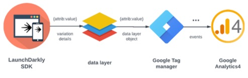
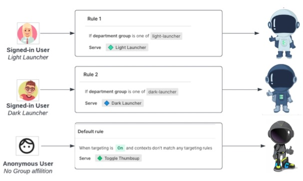
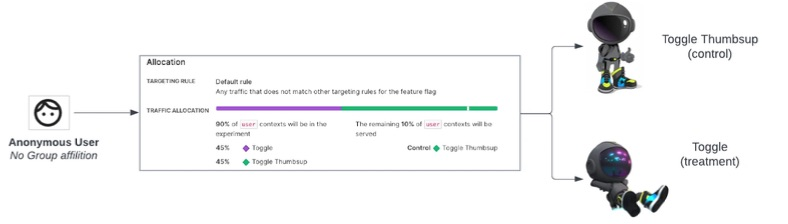

# LaunchDarkly to Google Analytics 4 Integration
This project demonstrates how to integrate LaunchDarkly with Google Analytics 4 using React.


  


  
*target rule*

  
*Experimentation*


## Requirement
* React >=18
* LaunchDarkly React client SDK
* Node.js >=18.x
* [LaunchDarkly Client side ID](https://docs.launchdarkly.com/sdk/concepts/client-side-server-side?site=federal#understanding-the-different-types-of-sdks)

This project was bootstrapped with [Create React App](https://github.com/facebook/create-react-app).


## Getting Started
### LaunchDarkly Setup
**Create feature flag:  "toggle details" / toggle-details**

Variations:
* Light Launcher
  ```json
  {
    "backgroundImage": "ThumbsUpLight.png",
    "heroImage": "ThumbsUpLight.png",
    "heroName": "Light Launcher",
    "flagKey": "toggle-details",
    "name": "ThumbsUpLight"
  }
  ```
* Dark Launcher
  ```json
  {
    "backgroundImage": "ThumbsUpDark.png",
    "heroImage": "ThumbsUpDark.png",
    "heroName": "Dark Launcher",
    "flagKey": "toggle-details",
    "name": "ThumbsUpDark"
  }
  ```
* Toggle
  ```json
  {
    "backgroundImage": "Toggle.png",
    "heroImage": "Toggle.png",
    "heroName": "Toggle",
    "flagKey": "toggle-details",
    "name": "Toggle"
  }
  ```
* Toggle Thumbsup
  ```json
  {
    "backgroundImage": "ToggleThumbsUp.png",
    "heroImage": "ToggleThumbsUp.png",
    "heroName": "Toggle Thumbsup",
    "flagKey": "toggle-details",
    "name": "ToggleThumbsUp"
  }
  ```

**Create feature flag: "Dark Mode" / dark-mode**

variations:
* Available: true
* Unavailable: false

**Create feature flags:  Debug / debug**

variations:
* Available: true
* Unavailable: false

