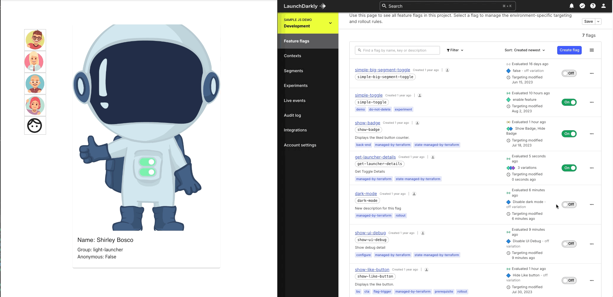

# Sample LaunchDarkly to Google Analytics 4 integration
### Requirement
* React >=18
* LaunchDarkly React client SDK
* Node.js >=18.x
* [LaunchDarkly Client side ID](https://docs.launchdarkly.com/sdk/concepts/client-side-server-side?site=federal#understanding-the-different-types-of-sdks)
  
This project was bootstrapped with [Create React App](https://github.com/facebook/create-react-app).

### Installation
1. Create .env file and copy your project clientSideID.

```
REACT_APP_clientSideID="LD client side ID"
```
### Running application
```
npm start
```

### Build static site

```
npm run build
```

### Run static site
```
npx serve build
```

### Feature Flags
#### 1. Name/Key: toggle details/toggle-details
##### Variations
Name: Light Launcher
```
   {
  "backgroundImage": "ThumbsUpLight.png",
  "heroImage": "ThumbsUpLight.png",
  "heroName": "Light Launcher",
  "flagKey":"toggle-details",
  "name": "ThumbsUpLight"
}
```

Name: Dark Launcher
```
{
  "backgroundImage": "ThumbsUpDark.png",
  "heroImage": "ThumbsUpDark.png",
  "heroName": "Dark Launcher",
  "flagKey":"toggle-details",
  "name": "ThumbsUpDark"
}
```

Name: Toggle
```
{
  "backgroundImage": "Toggle.png",
  "heroImage": "Toggle.png",
  "heroName": "Toggle",
  "flagKey":"toggle-details",
  "name": "Toggle"
}
```


Name: Toggle Thumbsup
```
{
  "backgroundImage": "ToggleThumbsUp.png",
  "heroImage": "ToggleThumbsUp.png",
  "heroName": "Toggle Thumbsup",
  "flagKey":"toggle-details",
  "name": "ToggleThumbsUp"
}
```

#### 2. Name/Key: Dark Mode / dark-mode 
##### Variations
Name: Available   Value: true
Name: Unavailable Value: false


#### 3. Name/Key: Debug / debug
##### Variations
Name: Available   Value: true
Name: Unavailable Value: false

